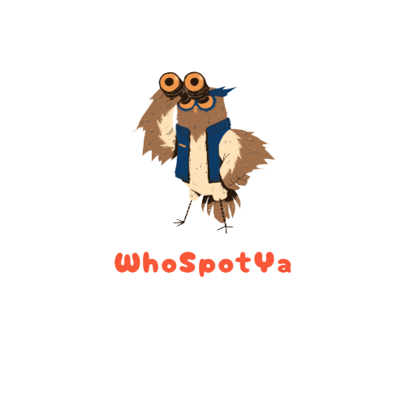

# Who Spot Ya - a community for bird admireres

## Getting Started

During the planning phase I needed to figure out what data I needed to store for my models. I decided on 3 main models, USER, BIRD, and COMMENT. I also decided on building this app using referenced data instead of embeded, so all 3 models at some point reference each-other.

The next step of planning was figuring out the routing/controllers, I wanted to be able to access Birds and Users when interacting with the community page or user home page. Also leaving comments on the main community page was a big part of the app.

Ease of access was a big part of the views planning. I wanted to be sure each of the main route can be accessed from most pages.

## Attributions

- Logo designed by Nicole Riccio
- Academind video which was helpful in using the populate method on multiple queries
  https://www.youtube.com/watch?v=3p0wmR973Fw&t=130s
- Also Josh Miller helped me out of a few roadblocks

## Technologies

Javascript, CSS, EJS, MongoDB, Mongoose, Node.js, Express, Morgan, bcrypt, express-session, method-override

## Stretch Goals

- AAU I want to upload pictured of birds spotted
- AAU I want to have a collection of friends
- I'd like to improve on the style more and have some more dynamic interactions
